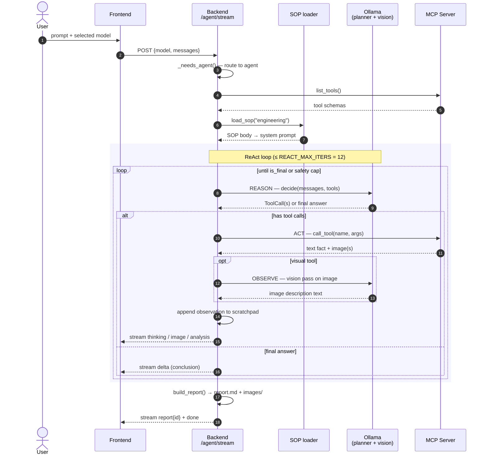
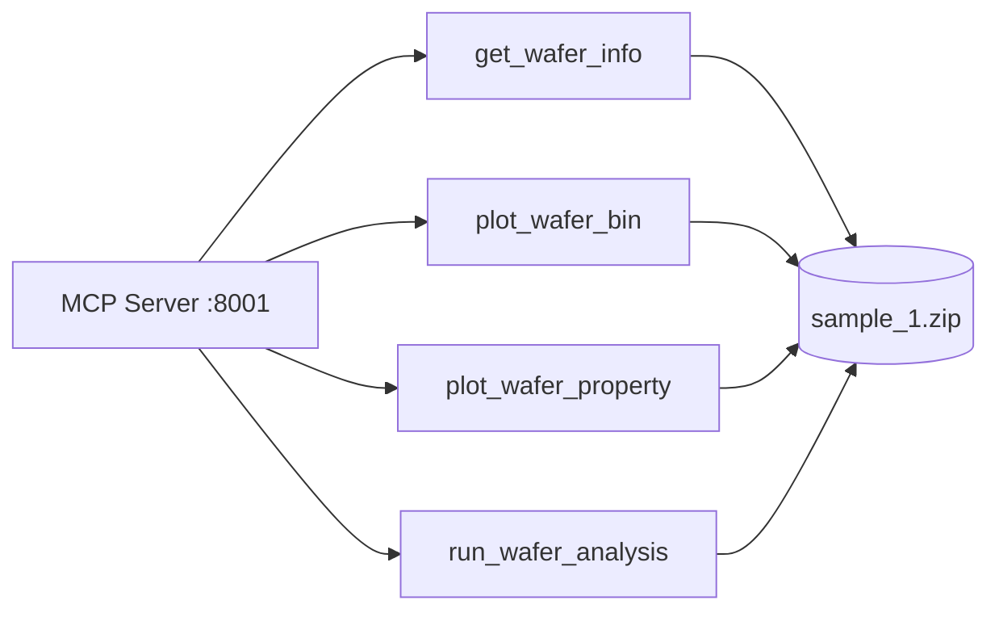

# LLM Yield Engine — Architecture

> Deep-dive companion to the [README](README.md). The README shows you how to run it; this document explains how the parts fit together and **why** the design is what it is.

---

## 1. System Overview

```mermaid
flowchart LR
    U([User]) -->|prompt| FE[Frontend<br/>React + Vite]

    subgraph PROD["one-process production mode"]
        FE -.->|served from| BE
    end

    FE -->|"/agent/stream<br/>/chat/stream<br/>/api/models"| BE[Backend<br/>FastAPI · :8000]
    BE -->|MCP Streamable HTTP| MCP[MCP Server<br/>FastMCP · :8001]
    BE -->|"/api/chat<br/>/api/tags"| OL[(Ollama · :11434<br/>any installed model)]
    MCP -->|read| DATA[(sample_1.zip<br/>BIN · X · Y · WAFER_ID · PIN_*)]
    BE -->|loaded at start| SOP[(agent/sop/<br/>engineering.md)]
    BE -->|write per run| REP[(reports/<br/>{ts}_{lot}_W{wafer}/)]

    classDef store fill:#fef,stroke:#c8c
    class DATA,SOP,REP store
```

**Service ports**

| Service | Port | Notes |
|---|---|---|
| Frontend (Vite dev) | 5173 | hot-reload mode only; proxies `/agent` `/chat` `/report` `/health` `/api` to `:8000` |
| Backend (FastAPI) | 8000 | also serves the built `frontend/dist/` in production mode (one URL for everything) |
| MCP Server (FastMCP) | 8001 | local only; backend is the only client |
| Ollama | 11434 | the user starts and pulls models themselves |

**Dynamic model selection.** Both `/chat/stream` and `/agent/stream` accept `{ "model": "<ollama-tag>" }` in the payload. The frontend `<ModelSelector>` fetches the list via `GET /api/models` (a thin proxy over Ollama's `/api/tags`) and persists the user's choice in `localStorage`. The chosen model is used for both the planner and the vision pass.

---

## 2. Component Anatomy

```
backend/app/
├── main.py                    FastAPI: /chat/stream · /agent/stream · /api/models · /report/{id}/{download,files}
├── mcp_client/
│   └── client.py              thin async HTTP client wrapping the MCP transport
└── agent/
    ├── config.py              defaults: PLANNER/VISION_MODEL · DEFAULT_FILE · REACT_MAX_* · REPORTS_DIR
    ├── vision_analyst.py      stream_image_analysis() / stream_pin_batch_analysis() over Ollama
    ├── report.py              ReportData / StepRecord → build_report() → reports/{ts}_{lot}_W{wafer}/
    ├── sop/
    │   ├── loader.py          parses YAML frontmatter + markdown body
    │   └── engineering.md     SOP: Fixed Steps + Adaptive Investigation rules
    └── react/                 ── the ReAct loop ──
        ├── loop.py            run_react_agent() — main while-loop + scratchpad + final_summary
        ├── reasoner.py        REASON — decide() via Ollama native tool-calling
        ├── tool_runner.py     ACT — REACT_TOOLS schema + run_tool() (forwards to mcp_client)
        ├── observation.py     OBSERVE — tool result → text observation
        │                                (with vision pass for image-yielding tools)
        └── policy.py          stop conditions (REACT_MAX_ITERS / REACT_MAX_ERRORS)
```

The split mirrors the conceptual ReAct triplet (Reason · Act · Observe), with two extras (`policy.py` for termination, `loop.py` as the orchestrator). Every behaviour that varies lives in one of these injected components — the loop itself is small and stable.

---

## 3. ReAct Loop Execution Flow



**Two ways the loop ends**

| Termination | Trigger | What happens |
|---|---|---|
| Natural | `decision.is_final == True` (planner returns final answer with no tool calls) | conclusion is captured into the report and streamed as the chat bubble |
| Forced (safety cap) | `should_stop(state)` — iteration ≥ 12 or errors ≥ 3 | `_final_summary()` injects a "stop calling tools, write the conclusion now" instruction and the planner is run one last time |

**Scratchpad — the memory of the loop** ([loop.py](backend/app/agent/react/loop.py) `Scratchpad` class). It's a plain `messages: list[dict]`. SOP is injected once into the system prompt at construction. Each round appends:
- An `assistant` message with `tool_calls` (the planner's chosen action)
- A `tool` message with the observation text (what the planner sees on the next round)

Every round, `decide()` reads the entire scratchpad — so the planner always has the full trajectory, exactly as ReAct prescribes.

---

## 4. NDJSON Event Vocabulary (Backend → Frontend)

Each event is one line of JSON, `\n` separated.

| Event | Emitted by | Frontend handler |
|---|---|---|
| `thinking` | every step transition (calling tool, rendering image, etc.) | ThinkingPanel timeline node |
| `image` | `observe()` for image-yielding tools | ImageGrid cell inside the chat bubble |
| `analysis` | vision-pass tokens (streamed) | text caption attached to the image |
| `delta` | the planner's final conclusion (streamed) | main chat bubble content |
| `postdelta` | post-image text after a batch (rare) | chat bubble below ImageGrid |
| `conclusion` | internal — captured for the report only | not forwarded to the frontend |
| `report` | after `build_report()` finishes | Report panel becomes visible, download button enabled |
| `done` | end of stream | switches UI back to idle state |

---

## 5. MCP Tool Server

Tools are organised by category under `mcp/tools/`. Each is exposed via `@mcp.tool()` in `mcp/server.py` and declared to the planner via `REACT_TOOLS` in [`tool_runner.py`](backend/app/agent/react/tool_runner.py).

| Tool | Category | Inputs | Returns |
|---|---|---|---|
| `get_wafer_info` | `information_read/` | `file_path` | text fact card (yield, pass/fail counts, PIN columns discovered) |
| `plot_wafer_bin` | `wafer_map/` | `file_path` | binary pass/fail PNG |
| `plot_wafer_property` | `wafer_map/` | `file_path`, `pin_column` | property heatmap PNG (IQR auto-scaled) |
| `run_wafer_analysis` | `workflow/` | `file_path` | composite — info + binary map + all PIN maps in one call |



**Adding a new tool**
1. Drop `mcp/tools/<category>/your_tool.py` and expose a function.
2. Register in `mcp/server.py` with `@mcp.tool()`.
3. Add its JSON schema to `REACT_TOOLS` in `backend/app/agent/react/tool_runner.py`.
4. (Optional) Reference it in `agent/sop/engineering.md` if it belongs in the Fixed Steps.

---

## 6. Design Choices — Why SOP-guided ReAct

This is the deliberate part of the architecture. The agent is **not** a textbook ReAct implementation — it makes four pointed adaptations for production use in an engineering setting.

### The motivating principle

> Engineers care about SOPs. Rather than have users keep re-tuning the agent, it is better to let experienced senior engineers define the direction. Engineers don't have time to let the model trial-and-error its way through; they want one complete, ordered analysis flow.

This is the single decision that drives most of what follows. A pure ReAct agent is reactive and exploratory — great for open-ended tasks, painful when the user is an engineer who already knows the right sequence of moves and wants the output to be reproducible across runs and across people.

### How this implementation maps to canonical ReAct

The reference is Yao et al., *ReAct: Synergizing Reasoning and Acting in Language Models* (ICLR 2023). What the original prescribes vs. what we do:

| Original ReAct | This implementation | Why we diverge |
|---|---|---|
| Reason / Act / Observe triplet, full trajectory in context | ✅ Same — three files, single growing scratchpad | (aligned) |
| LLM decides when to stop (`Finish[answer]`) | ✅ Same — `decision.is_final` + safety caps | (aligned + production-grade caps) |
| Action emitted as text (`Action: search[q]`), parsed by regex | Structured tool-calling — `ToolCall(name, args)` from Ollama's native `tools` API | Modern engineering standard (Toolformer-style). Cuts parsing fragility to zero. |
| Thought emitted as visible text alongside Action | Thought is **not** required; `think=False` is passed to Ollama | Trade interpretability for latency and token cost. Frontend's "Thinking" panel shows the *programmatic* step description, not the model's chain-of-thought. |
| LLM freely chooses the next step | **SOP is injected into the system prompt** as a sequence of Fixed Steps that MUST run first, followed by Adaptive Investigation | The motivating principle above. Engineers want the evidence chain to be the same every time. |
| One Action per turn, Observation is the raw env response | OBSERVE can do an extra vision-LLM pass to convert images into text descriptions before they enter the scratchpad | The planner does not need to be a vision model — the vision call is a grounding step nested inside Observe. |

### Where this lands in the agent-design landscape

```
  pure ReAct                  ── this implementation ──             AutoGen / CrewAI
 ────────────────────────────────────────────────────────────────────────────────────
 LLM fully autonomous                                              strong workflow constraints
 text-parsed actions                                               role-based agent comms
 explicit thought trace                                            opaque agent comms
```

A more precise label: **"SOP-guided ReAct with native tool calling and multi-modal observation enrichment"**. The architecture is closest in spirit to **MetaGPT**'s SOP-driven multi-agent setup (Hong et al., ICLR 2024) but kept single-agent for simplicity.

### Why this matters for *this* user

Wafer yield analysis is an inherently SOP-driven activity. The engineer's question is rarely "figure out what to do" — it is "do the standard analysis and tell me what the data says." The Fixed Steps in [`engineering.md`](backend/app/agent/sop/engineering.md) (`get_wafer_info` → binary map → PIN properties → P-charts) encode that standard. A pure ReAct agent might skip a step the engineer always wants, or do them in a different order each run, both of which break the engineer's mental model and make outputs hard to compare across runs.

The cost we accept in exchange: less novelty (the agent will not invent a new analytical method), and a constrained surface for the LLM to be useful (it can only choose *whether* a step's findings warrant Adaptive Investigation — not whether to do the Fixed Steps at all).

### Recommended reading

| Topic | Paper |
|---|---|
| ReAct itself | Yao et al., *ReAct: Synergizing Reasoning and Acting in Language Models* (ICLR 2023) |
| Plan-and-Execute as an alternative | Wang et al., *Plan-and-Solve Prompting* (ACL 2023) |
| SOP-guided multi-agent | Hong et al., *MetaGPT: Meta Programming for Multi-Agent Collaborative Framework* (ICLR 2024) |
| Structured tool calling | Schick et al., *Toolformer: Language Models Can Teach Themselves to Use Tools* (NeurIPS 2023) |
| Field survey | Wang et al., *A Survey on Large Language Model based Autonomous Agents* (2023) |
