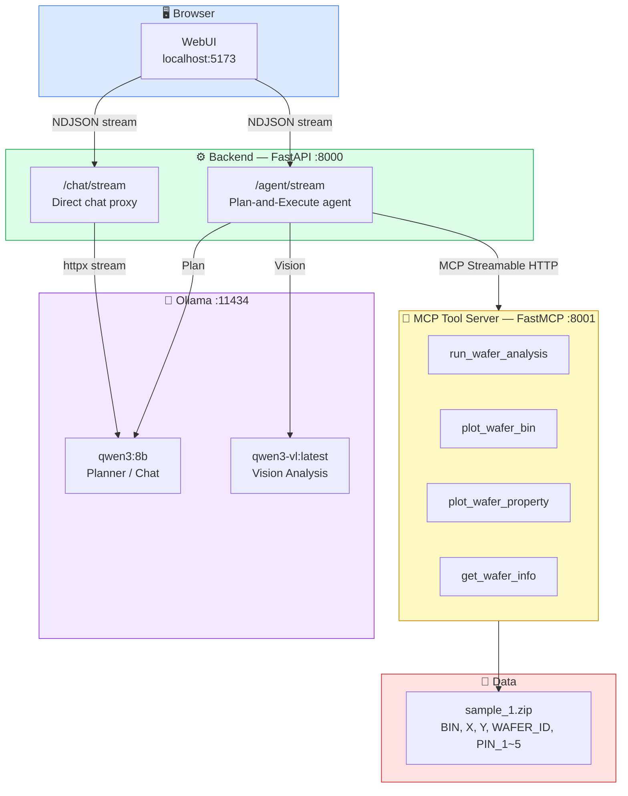
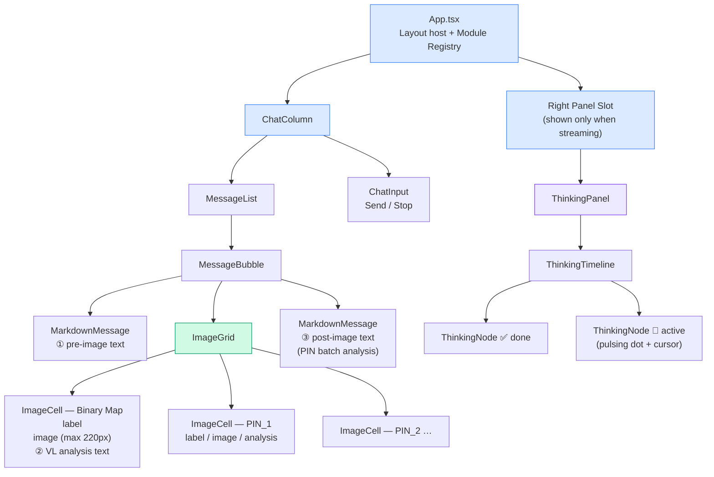
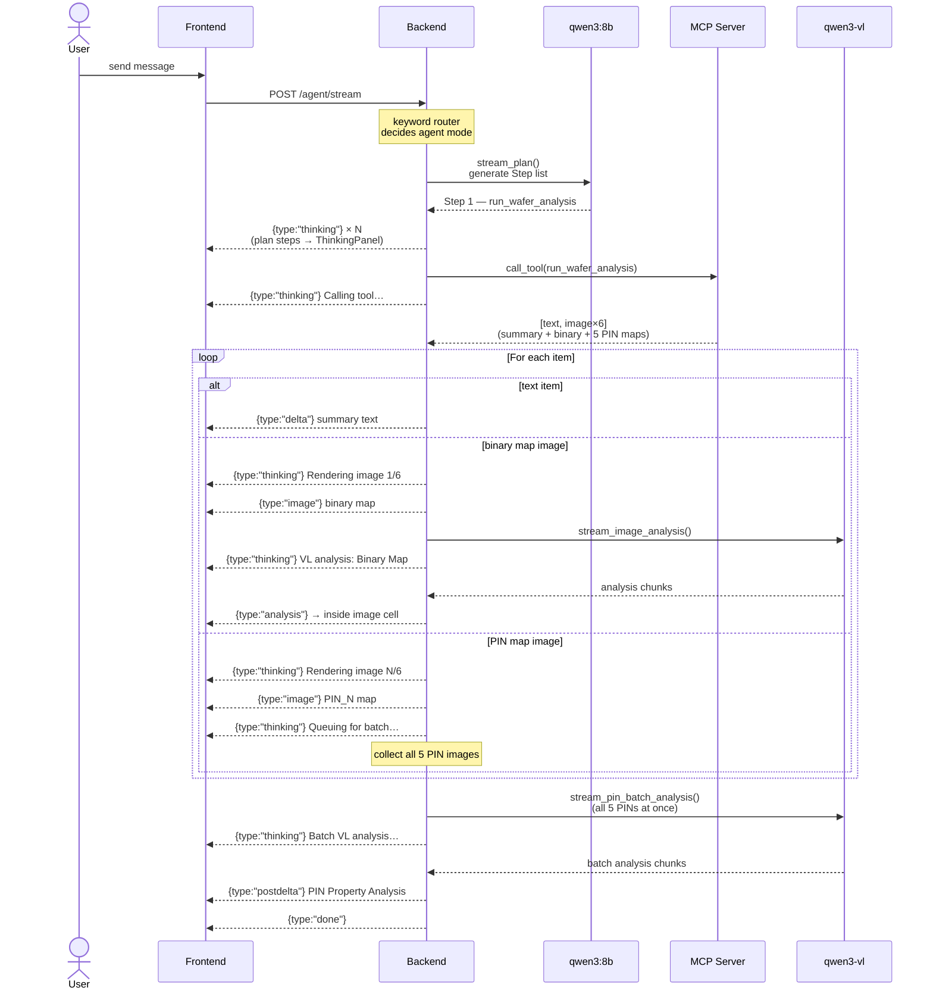
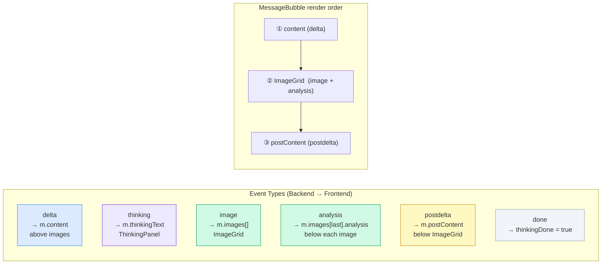
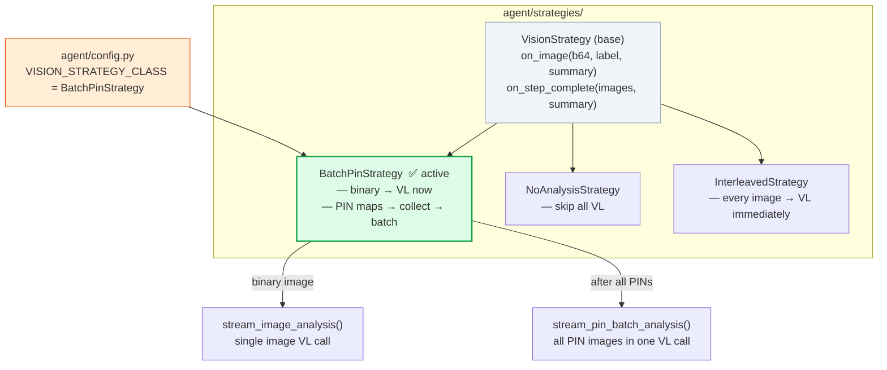
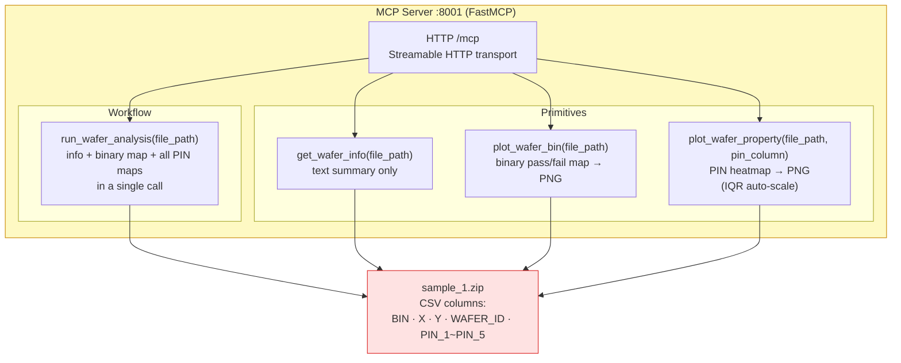

# WebUI System Architecture

---

## 1. System Overview

---

## 2. Frontend Component Tree

---

## 3. Agent Pipeline — Request Flow

---

## 4. NDJSON Event Types

---

## 5. Vision Strategy Pattern

---

## 6. MCP Tool Server

