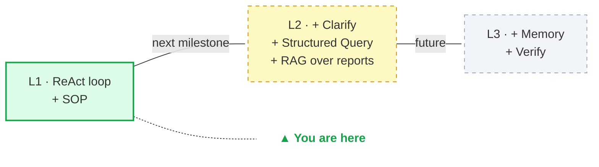
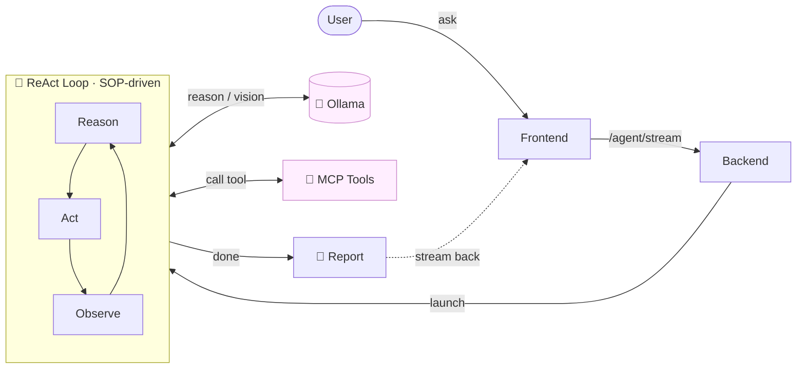

# LLM Yield Engine
### A SOP-driven LLM agent for wafer yield analysis · roadmap to L2

> A local-first agent that takes a natural-language question about wafer data, follows an engineering SOP, calls MCP tools to read and plot the data, runs vision-language analysis on every plot, and emits a self-contained report. **Current: L1 (ReAct loop + SOP). Next milestone: L2 (Clarify + Structured Query + RAG over past reports).** Everything runs on your own machine via Ollama — no cloud calls, no API keys.

---

## 1. Vision — L1 → L2

### Why an engineering yield agent needs a SOP-driven design

Wafer yield analysis is an inherently SOP-driven activity. The engineer's question is rarely *"figure out what to do"* — it is *"do the standard analysis and tell me what the data says."* A pure ReAct agent that freely decides each step might skip something the engineer always wants, or do the steps in a different order each run. Both break the engineer's mental model and make outputs hard to compare across runs.

This project encodes that standard procedure as a **SOP injected into the system prompt** ([`engineering.md`](backend/app/agent/sop/engineering.md)). The agent's Fixed Steps (`get_wafer_info` → binary map → PIN properties → P-charts) run the same way every time. Adaptive Investigation comes after, and only after.

### Capability ladder

The broader framework this is part of has three levels. The current code implements L1; the roadmap targets L2 within the next milestone.



| Level | What it adds | What it unlocks |
|---|---|---|
| **L1 (current)** | ReAct loop + SOP-driven Fixed Steps + vision-pass observation + report builder | Standard analysis on a given lot — engineer specifies the file, agent runs the SOP end-to-end |
| **L2 (next)** | Clarify (agent asks back when query is vague) + Structured Query (list lots / products by metadata) + RAG over past reports | Engineer can ask *"show me this week's worst lot"* without specifying a file; agent can reference past similar cases |
| **L3 (future)** | Memory (baseline of normal behaviour) + Verify (sanity-check outputs, falsify hypotheses) | Anomaly detection against baseline; hypothesis testing (*"is this PIN_5 issue thermal-related?"*) |

### Walking the ladder with one user ask

To make the levels concrete, take a typical engineer question:

> *"Show me this week's worst wafer."*

Same ask, three different agent behaviours:

| # | Workflow stage | L1 (now) | L2 (next) | L3 (future) |
|---|---|---|---|---|
| 1 | Resolve ambiguous input | ❌ silently falls back to `DEFAULT_FILE` — analyzes the wrong wafer | ✅ **Clarify** asks *"which product?"* → user picks | (same as L2) |
| 2 | Locate the right data | ❌ — uses default | ✅ **Structured Query**: `list_worst_lots(product, week)` returns the lot | (same as L2) |
| 3 | Run Fixed Steps (SOP) | ✅ binary map / PIN maps / P-charts in fixed order | (same) | (same) |
| 4 | Vision pass per plot | ✅ VL model describes each image | (same) | (same) |
| 5 | Pull historical context | ❌ — | ✅ **RAG** retrieves past reports with similar PIN signatures | (same as L2) |
| 6 | Compare to baseline | ❌ — | ❌ — | ✅ **Memory** loads product-line baseline; agent computes deltas |
| 7 | Sanity-check the conclusion | ❌ raw LLM output ships to user | ❌ — | ✅ **Verify** flags impossible numbers and unsupported claims |
| 8 | Archive the report | ✅ markdown + images | ✅ + auto-index the new report into the vector DB | (same as L2) |

**What the user actually gets back:**

- **L1** — *"I analyzed `sample_1.zip` and here is the report."*
  Wrong wafer. The engineer has to manually find the file and re-ask. Useful only when the engineer already knows exactly which lot to analyse.
- **L2** — *"I narrowed it down to `UPF315-W22-007` (yield 72.4%). Three past lots showed similar PIN_3 cluster failures; engineers attributed them to thermal stage drift. Here is the standard analysis."*
  Correct wafer, useful historical context. Engineer can act on this.
- **L3** — *"…and compared to the last 30 days for UPF315, this lot is 12pp below the median yield and the PIN_3 cluster pattern matches three past thermal events with high confidence. One claim in the auto-draft (PIN_5 wear) was not supported by the data and has been removed. Flagged for engineer review."*
  Correct, contextualized, baselined, audit-trailed. The agent now has an opinion the engineer can trust without re-checking.

The pattern is consistent: **L1 runs the SOP, L2 figures out *what* to run the SOP on and *what past cases say*, L3 figures out *whether the result is normal* and *whether the conclusion is sound*.** Only L3 actually closes the loop an engineer needs to make a call without a second pair of eyes.

For the design rationale behind specific choices made along this ladder, see [`learning/`](learning/) — concept-level notes on the why, separate from the how.

---

## 2. Current implementation (L1)

The L1 system is the ReAct loop (`reason → act → observe`) running over an MCP tool server, driven by an engineering SOP loaded at startup.

### Component topology



### What's actually happening

1. **Frontend** posts the user's message to `/agent/stream`. The backend's `_needs_agent()` router decides: small talk goes straight to Ollama (`qwen3:8b`); an analysis request enters the ReAct agent.
2. **SOP is loaded first.** [`agent/sop/engineering.md`](backend/app/agent/sop/engineering.md) defines the *Fixed Steps* (`get_wafer_info` → binary map → PIN properties → P-charts) and the *Adaptive Investigation* rules. Its body is injected as the system prompt, so every run starts with the same evidence chain.
3. **ReAct loop** (`reason → act → observe`):
   - **Reason** — the planner LLM picks the next tool (or declares it's done).
   - **Act** — the MCP server actually opens the ZIP, runs the analysis, and renders the plot.
   - **Observe** — visual results are passed back through a vision-language pass; the resulting text observation is appended to the scratchpad for the next round.
4. **Safety caps**: `REACT_MAX_ITERS = 12`, `REACT_MAX_ERRORS = 3`. If hit, the agent is forced to write a conclusion from what it already has.
5. **Report builder** assembles a self-contained folder under [`reports/`](reports/) per the template in [`report_format_example.md`](report_format_example.md): `report.md` + `images/*.png`. The frontend exposes a one-click `.zip` download.

For a deeper walk-through of the ReAct package internals, see [ARCHITECTURE.md](ARCHITECTURE.md).

---

## 3. Getting started

### Prerequisites

- **Python 3.11+**
- **Node.js 18+** (only needed the first time, to build the UI)
- **[Ollama](https://ollama.com/)** running locally with these models pulled:
  ```bash
  ollama serve                 # in its own terminal, or as a service
  ollama pull qwen3.5:4b       # planner + vision (used by the agent)
  ollama pull qwen3:8b         # plain chat fallback
  ```

### Run (one command)

```bash
# 1. Python deps (use a venv)
python -m venv .venv
.venv\Scripts\activate            # Windows
# source .venv/bin/activate       # macOS / Linux
pip install -r requirements.txt

# 2. Launch everything
python run.py
```

That's it. `run.py` will:

1. Check Ollama is reachable.
2. Build the frontend the first time (`npm install` + `npm run build`) — auto-skipped on subsequent runs.
3. Spawn the MCP server (`:8001`) and the backend (`:8000`) as child processes. The backend serves the built UI itself, so the whole app lives at one URL.
4. Open <http://localhost:8000> in your browser.
5. On `Ctrl+C`, shut both children down cleanly.

Useful flags:

```bash
python run.py --no-browser    # don't auto-open the browser
python run.py --rebuild       # force a fresh frontend build (after UI changes)
```

Try in the browser:

> *"Hi, please analyze the sample wafer data."*

You should see the Thinking panel stream the SOP steps, the chat bubble fill with images and analyses, and a Report tab appear with a download button.

### Development mode (frontend hot-reload)

If you're iterating on the frontend, the production build flow above is too slow. Use 3 terminals instead — Vite's dev server proxies API calls to the backend, so relative URLs still work:

| # | Service | Command | Port |
|---|---|---|---|
| 1 | MCP server | `python mcp/server.py` | 8001 |
| 2 | Backend | `uvicorn backend.app.main:app --reload --port 8000` | 8000 |
| 3 | Frontend (Vite dev) | `cd frontend && npm run dev` | 5173 |

Open <http://localhost:5173> for hot-reload. (Ollama needs to be running too, just like in production.)

---

## 4. Repository layout

```
LLM_Yield_Engine/
├── README.md                       this file
├── ARCHITECTURE.md                 deeper component diagrams
├── report_format_example.md        template the report builder follows
├── requirements.txt                Python deps (backend + MCP share one venv)
├── run.py                          one-command launcher
│
├── learning/                       concept-level design notes (why, not how)
│
├── backend/                        FastAPI service · :8000
│   └── app/
│       ├── main.py                 routes: /chat/stream · /agent/stream · /api/models · /report/*
│       ├── mcp_client/             HTTP client for the MCP server
│       └── agent/                  the L1 agent core
│           ├── config.py           models, data path, safety caps, reports dir
│           ├── report.py           assembles report.md + images/
│           ├── vision_analyst.py   VL streaming wrapper (Observe-time vision pass)
│           ├── react/              ReAct loop: Reason · Act · Observe primitives
│           └── sop/                Fixed Steps + loader (SOP injection layer)
│
├── frontend/                       React + Vite UI · :5173
│
├── mcp/                            FastMCP tool server · :8001
│   ├── server.py
│   └── tools/
│       ├── information_read/       get_wafer_info
│       ├── statistic_plot/         P-chart rendering
│       ├── wafer_map/              binary map · PIN property maps
│       └── workflow/               run_wafer_analysis (composite)
│
├── raw_data_example/
│   └── wafer_data/sample_1.zip     CSV inside: BIN, X, Y, WAFER_ID, PIN_1..PIN_N
│
└── reports/                        generated per run (gitignored)
```

---

## 5. Extending — tools, SOPs, configuration

Tool coverage is the real bottleneck for L2 expansion — adding a new analysis capability is a matter of dropping a Python file, not editing the framework.

### Adding a new MCP tool

1. Drop the implementation under `mcp/tools/<category>/your_tool.py` and expose a function.
2. Register it in [`mcp/server.py`](mcp/server.py) with `@mcp.tool()`.
3. Add the tool's JSON schema to `REACT_TOOLS` in [`backend/app/agent/react/tool_runner.py`](backend/app/agent/react/tool_runner.py) so the planner knows about it.
4. (Optional) Reference it in the SOP at [`backend/app/agent/sop/engineering.md`](backend/app/agent/sop/engineering.md) if it belongs in the Fixed Steps.

> **Design note** — when the new capability is data access (querying a DB, listing lots), write it as a **typed function** with explicit parameters, not as a generic SQL executor that the LLM fills with raw SQL. The reasoning is in [`learning/typed-function-vs-llm-sql.md`](learning/typed-function-vs-llm-sql.md).

### Configuration

Knobs live in [`backend/app/agent/config.py`](backend/app/agent/config.py):

| Variable | Default | What it does |
|---|---|---|
| `PLANNER_MODEL` / `VISION_MODEL` | `qwen3.5:4b` | Ollama model tag for the agent (also overridable from the frontend's model picker) |
| `DEFAULT_FILE` | `raw_data_example/wafer_data/sample_1.zip` | Data file when the user doesn't specify one. Overridable via `WAFER_DATA_FILE` env var. |
| `REACT_MAX_ITERS` | `12` | Hard cap on reasoning rounds |
| `REACT_MAX_ERRORS` | `3` | Abort after this many failed tool calls |
| `REPORTS_DIR` | `reports/` at repo root | Where archived runs are written |

Point at a different data file:

```bash
# Windows PowerShell
$env:WAFER_DATA_FILE = "C:\path\to\your\wafer.zip"
python run.py
```

---

## License

[MIT](LICENSE) © 2026 Cheng Wei Tseng.
